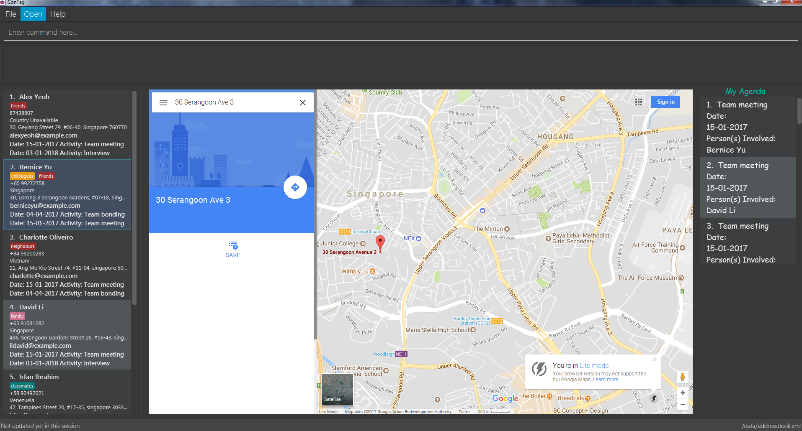

= ConTag
ifdef::env-github,env-browser[:relfileprefix: docs/]
ifdef::env-github,env-browser[:outfilesuffix: .adoc]

https://www.travis-ci.org/CS2103AUG2017-T15-B2/main[image:https://www.travis-ci.org/CS2103AUG2017-T15-B2/main.svg?branch=master[Build Status]]
https://coveralls.io/github/CS2103AUG2017-T15-B2/main?branch=master[image:https://coveralls.io/repos/github/CS2103AUG2017-T15-B2/main/badge.svg?branch=master[Coverage Status]]

ifdef::env-github[]

endif::[]

ifndef::env-github[]
image::images/Ui.png[width="600"]
endif::[]

* Contag is an efficient and feature-packed address book desktop application custom-built for PC, capable of organizing contacts for even the most demanding business users and busiest frequent travellers.
* It is a Java application built for the most demanding business users as well as frequent travellers.
* It has a GUI but most of the user interactions happen using a CLI (Command Line Interface).
* What's different from https://github.com/se-edu/addressbook-level3[level 3]:
** A more sophisticated GUI that includes a list  panel and an in-built Browser.
** More test cases, including automated GUI testing.
** Support for _Build Automation_ using Gradle and for _Continuous Integration_ using Travis CI.

== Site Map

* <<UserGuide#, User Guide>>
* <<DeveloperGuide#, Developer Guide>>
* <<AboutUs#, About Us>>
* <<ContactUs#, Contact Us>>

== Acknowledgements

* The original source of the code is taken from AddressBook-Level4 project created by SE-EDU initiative at https://github.com/se-edu/[Software Engineering Education - FOSS Resources]
* Some parts of this sample application were inspired by the excellent http://code.makery.ch/library/javafx-8-tutorial/[Java FX tutorial] by
_Marco Jakob_.

== Licence : link:LICENSE[MIT]
