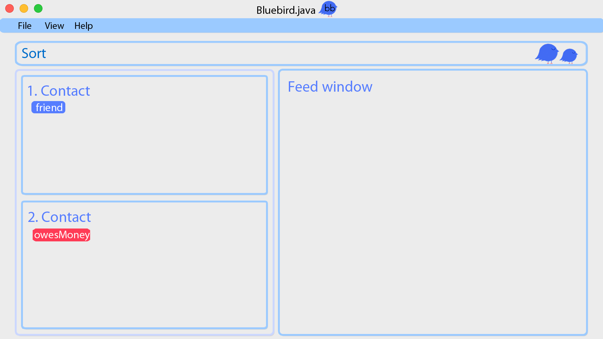

= Bluebird
ifdef::env-github,env-browser[:relfileprefix: docs/]
ifdef::env-github,env-browser[:outfilesuffix: .adoc]

https://travis-ci.org/CS2103AUG2017-T15-B4/main[image:https://travis-ci.org/CS2103AUG2017-T15-B4/main.svg?branch=master[Build Status]]
https://ci.appveyor.com/project/deep4k/main[image:https://ci.appveyor.com/api/projects/status/t9vialwj2uf9t5ub?svg=true[Build status]]
https://coveralls.io/repos/github/CS2103AUG2017-T15-B4/main?branch=master[image:https://coveralls.io/repos/github/CS2103AUG2017-T15-B4/main/badge.svg?branch=master[Coverage Status]]
https://www.codacy.com/app/deep4k/main/dashboard[image:https://api.codacy.com/project/badge/Grade/e465693d0a7549f9bc73ed44344ebd5c[Codacy Badge]]

ifdef::env-github[]

endif::[]

ifndef::env-github[]
image::images/bluebird_window.png[width="600"]
endif::[]

* This is a desktop Address Book application. It has a GUI but most of the user interactions happen using a CLI (Command Line Interface).
* It is a Java sample application intended for students learning Software Engineering while using Java as the main programming language.
* It is *written in OOP fashion*. It provides a *reasonably well-written* code example that is *significantly bigger* (around 6 KLoC)than what students usually write in beginner-level SE modules.

== Site Map

* <<UserGuide#, User Guide>>
* <<DeveloperGuide#, Developer Guide>>
* <<LearningOutcomes#, Learning Outcomes>>
* <<AboutUs#, About Us>>
* <<ContactUs#, Contact Us>>

== Acknowledgements

* Some parts of this sample application were inspired by the excellent http://code.makery.ch/library/javafx-8-tutorial/[Java FX tutorial] by
_Marco Jakob_.

* Built upon the addressbook-level 4 application by _SE-EDU_ team , for National University of Singapore(NUS) module CS2103.

== Licence : link:LICENSE[MIT]
