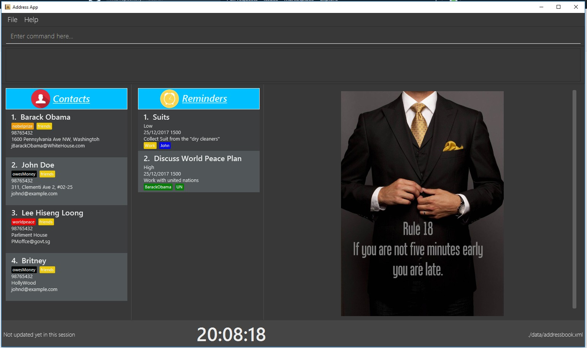

= Gentleman's Guide (V1.3)
ifdef::env-github,env-browser[:relfileprefix: docs/]
ifdef::env-github,env-browser[:outfilesuffix: .adoc]

https://travis-ci.org/CS2103AUG2017-T09-B1/main[image:https://travis-ci.org/CS2103AUG2017-T09-B1/main.svg?branch=master[Build Status]]
https://ci.appveyor.com/project/damithc/addressbook-level4[image:https://ci.appveyor.com/api/projects/status/3boko2x2vr5cc3w2?svg=true[Build status]]
https://coveralls.io/github/CS2103AUG2017-T09-B1/main?branch=master[image:https://coveralls.io/repos/github/CS2103AUG2017-T09-B1/main/badge.svg?branch=master[Coverage Status]]
https://www.codacy.com/app/damith/addressbook-level4?utm_source=github.com&utm_medium=referral&utm_content=CS2103AUG2017-T09-B1/main&utm_campaign=Badge_Grade[image:https://api.codacy.com/project/badge/Grade/fc0b7775cf7f4fdeaf08776f3d8e364a[Codacy Badge]]

ifdef::env-github[]

endif::[]

ifndef::env-github[]
image::images/Gentleman's Guide.jpeg[width="800"]
endif::[]

Looking way of keeping track of your contacts? Unsastified with ugly clunky designs currently avaliable?  

Look no further with the Gentleman's Guide. With a superb user interface and sleek, professional touch, Gentleman's Guide provides you with a contact book that even James Bond would love, shaken not stirred.

At the Heart of our Design is the idea that every man wants to be a Gentleman. Emcompassing that idea is a systems that respects you as you respect it. It provides the gentleman with exactly what he neededs, when he needs it. Nothing more, nothing less

== Want to experience elegance at its finest?

* [Download the latest release](https://github.com/CS2103AUG2017-T09-B1/main/releases)

== Site Map

* <<UserGuide#, User Guide>>
* <<DeveloperGuide#, Developer Guide>>
* <<AboutUs#, About Us>>
* <<ContactUs#, Contact Us>>

== Acknowledgements

* Some parts of this sample application were inspired by the excellent http://code.makery.ch/library/javafx-8-tutorial/[Java FX tutorial] by
_Marco Jakob_.

* This AddressBook application is modified from the original AddressBook-Level4 project, created by SE-EDU initiative at https://github.com/se-edu/

== Licence : link:LICENSE[MIT]
