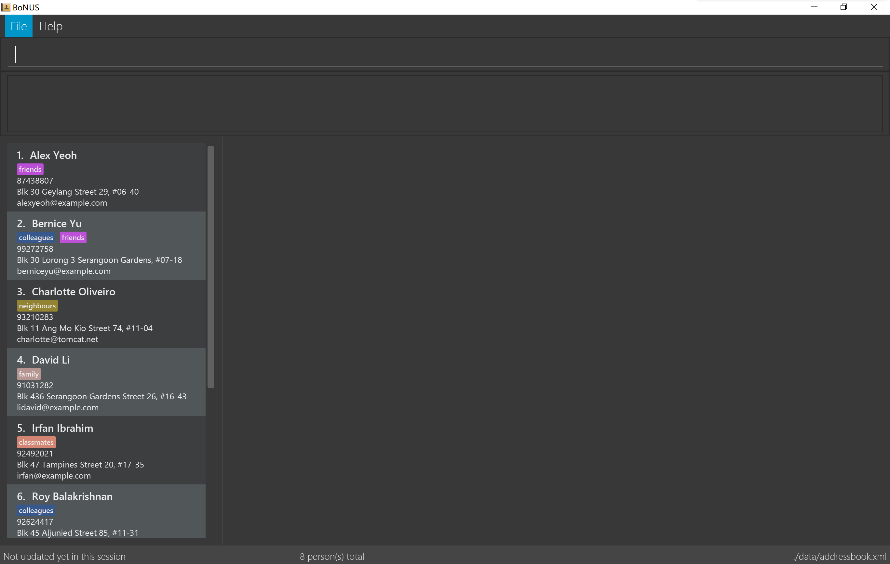

= Rolodex
ifdef::env-github,env-browser[:relfileprefix: docs/]
ifdef::env-github,env-browser[:outfilesuffix: .adoc]

https://travis-ci.org/CS2103AUG2017-W11-B2[image:https://travis-ci.org/CS2103AUG2017-W11-B2/main.svg?branch=master["Build Status", link="https://travis-ci.org/CS2103AUG2017-W11-B2/main"]]
https://ci.appveyor.com/project/ZY-Ang/main[image:https://ci.appveyor.com/api/projects/status/2yh61xpwvhmdgdkh?svg=true[Build status]]
https://coveralls.io/github/CS2103AUG2017-W11-B2/main?branch=master[image:https://coveralls.io/repos/github/CS2103AUG2017-W11-B2/main/badge.svg?branch=master[Coverage Status]]
https://www.codacy.com/app/ZY-Ang/main?utm_source=github.com&utm_medium=referral&utm_content=CS2103AUG2017-W11-B2/main&utm_campaign=Badge_Grade[image:https://api.codacy.com/project/badge/Grade/fe8643b566224b20b21c4c5bfbb64ae6[Codacy Badge]]

ifdef::env-github[]

endif::[]

ifndef::env-github[]
image::images/Ui.png[width="800"]
endif::[]

// tag::applicationDescription[]
Rolodex is a desktop contact management application for users who prefer working without a mouse to manage their contacts more efficiently.
If you are a businessman with a list of clients to remember, a teacher who wants to organize their student information, or anyone with a need for contact
management, Rolodex provides you with a way to organize your important contacts in a fast and productive manner.

The user interacts with the application using a CLI (Command Line Interface), and it has a GUI created with JavaFX.
It is written in Java, and has about 10 kLoC. +
// end::applicationDescription[]

== Site Map

* <<UserGuide#, User Guide>>
* <<DeveloperGuide#, Developer Guide>>
* <<AboutUs#, About Us>>
* <<ContactUs#, Contact Us>>

== Acknowledgements

* The original source code of this application is from the https://github.com/se-edu/addressbook-level4[AddressBook-Level4] project created by https://github.com/se-edu/[SE-EDU] initiative.
* Some parts of this sample application were inspired by the excellent http://code.makery.ch/library/javafx-8-tutorial/[Java FX tutorial] by
_Marco Jakob_.
* Some code used for fuzzy finding was adapted from http://rosettacode.org/wiki/Levenshtein_distance#Java[Rosetta Code] licensed under http://www.gnu.org/licenses/fdl-1.2.html[GNU Free Documentation License 1.2].
* The help window highlight function is implemented using Johann Burkard's http://johannburkard.de/blog/programming/javascript/highlight-javascript-text-higlighting-jquery-plugin.html[jQuery-highlight] and https://jquery.com/[jQuery].

== Licence : link:LICENSE[MIT]
