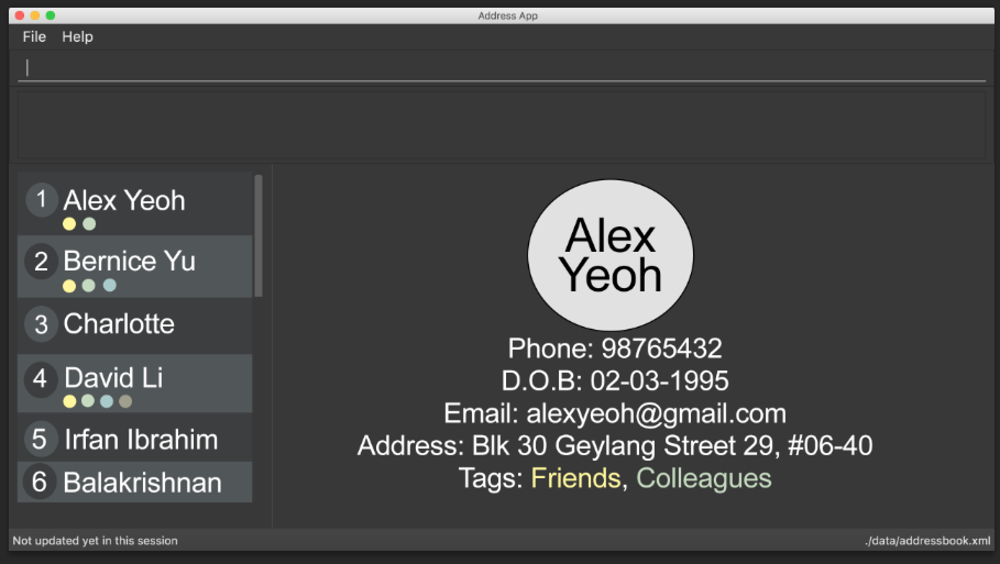

= Circles
ifdef::env-github,env-browser[:relfileprefix: docs/]
ifdef::env-github,env-browser[:outfilesuffix: .adoc]

https://travis-ci.org/CS2103AUG2017-T17-B3/main[image:https://travis-ci.org/CS2103AUG2017-T17-B3/main.svg?branch=master[Build Status]]
https://ci.appveyor.com/project/eldonng/main[image:https://ci.appveyor.com/api/projects/status/3boko2x2vr5cc3w2?svg=true[Build status]]
https://coveralls.io/github/CS2103AUG2017-T17-B3/main?branch=master[image:https://coveralls.io/repos/github/CS2103AUG2017-T17-B3/main/badge.svg?branch=master[Coverage Status]]
https://www.codacy.com/app/eldonng/main?utm_source=github.com&utm_medium=referral&utm_content=CS2103AUG2017-T17-B3/main&utm_campaign=Badge_Grade[image:https://api.codacy.com/project/badge/Grade/b13e2659a21e448ab8b3b31f4201d504[Codacy Badge]]

ifdef::env-github[]

endif::[]

ifndef::env-github[]
image::images/Circles UI.png[width="600"]
endif::[]

* This is a desktop Address Book application. It has a GUI but most of the user interactions happen using a CLI (Command Line Interface).
* It is a Java sample application intended for students learning Software Engineering while using Java as the main programming language.
* It is *written in OOP fashion*.
* What's different:
** A more sophisticated GUI that includes a list  panel.
** More test cases, including automated GUI testing.
** Support for _Build Automation_ using Gradle and for _Continuous Integration_ using Travis CI.

== Site Map

* <<UserGuide#, User Guide>>
* <<DeveloperGuide#, Developer Guide>>
* <<AboutUs#, About Us>>
* <<ContactUs#, Contact Us>>

== Acknowledgements

* Some parts of this sample application were inspired by the excellent http://code.makery.ch/library/javafx-8-tutorial/[Java FX tutorial] by
_Marco Jakob_.

* AddressBook-Level4 project created by SE-EDU initiative at https://github.com/se-edu/

== Licence : link:LICENSE[MIT]
