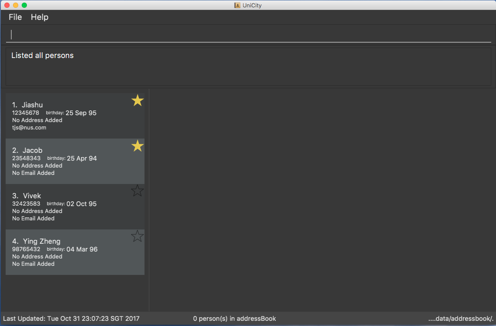

= UniCity
ifdef::env-github,env-browser[:relfileprefix: docs/]
ifdef::env-github,env-browser[:outfilesuffix: .adoc]

https://travis-ci.org/CS2103AUG2017-W13-B1/main[image:https://travis-ci.org/CS2103AUG2017-W13-B1/main.svg?branch=master[Build Status]]
https://ci.appveyor.com/project/taojiashu/main/branch/master[image:https://ci.appveyor.com/api/projects/status/98igkyl8ayr2bobk?svg=true[Build status]]
https://coveralls.io/github/CS2103AUG2017-W13-B1/main?branch=master[image:https://coveralls.io/repos/github/CS2103AUG2017-W13-B1/main/badge.svg?branch=master[Coverage Status]]
image:https://api.codacy.com/project/badge/Grade/9b5af045af0c4d3b86806c2a3293216a["Codacy code quality", link="https://www.codacy.com/app/taojiashu/main?utm_source=github.com&utm_medium=referral&utm_content=CS2103AUG2017-W13-B1/main&utm_campaign=Badge_Grade"]

//ifndef::env-github[]

//endif::[]

//ifdef::env-github[]
image::docs/images/Ui.png[width="600"]
//endif::[]

* This is a desktop Address Book application. It has a GUI but most of the user interactions happen using a CLI (Command Line Interface).
* It is a product targeting university students, who can use it to manage their connections and network in their courses of study in the univeristy.
* It is *written in OOP fashion*. It provides a *reasonably well-written* code example that is *significantly bigger* (around 6 KLoC) than what students usually write in beginner-level SE modules.
* What's different from https://github.com/se-edu/addressbook-level3[level 3]:
** A more sophisticated GUI that includes a list  panel and an in-built Browser.
** More test cases, including automated GUI testing.
** Support for _Build Automation_ using Gradle and for _Continuous Integration_ using Travis CI.

== Site Map

* <<UserGuide#, User Guide>>
* <<DeveloperGuide#, Developer Guide>>
* <<AboutUs#, About Us>>
* <<ContactUs#, Contact Us>>

== Acknowledgements

* Some parts of this sample application were inspired by the excellent http://code.makery.ch/library/javafx-8-tutorial/[Java FX tutorial] by
_Marco Jakob_.

* Original Source Code: AddressBook-Level4 project created by SE-EDU initiative at https://github.com/se-edu/

== Licence : link:LICENSE[MIT]
