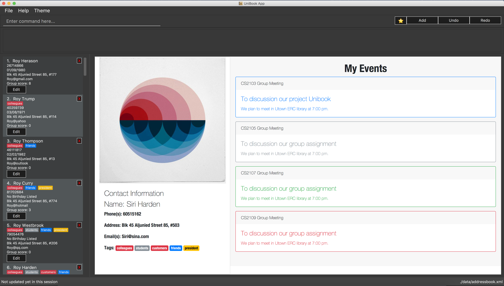

= Rolodex
ifdef::env-github,env-browser[:relfileprefix: docs/]
ifdef::env-github,env-browser[:outfilesuffix: .adoc]

https://travis-ci.org/CS2103AUG2017-W11-B2[image:https://travis-ci.org/CS2103AUG2017-W11-B2/main.svg?branch=master["Build Status", link="https://travis-ci.org/CS2103AUG2017-W11-B2/main"]]

ifdef::env-github[]

endif::[]

ifndef::env-github[]
image::images/Ui.png[width="600"]
endif::[]

Rolodex is a desktop address book application for computing professionals who prefer working without a mouse to manage their contacts more efficiently.
It has a GUI but most of the user interactions happen using a CLI (Command Line Interface).

== Site Map

* <<UserGuide#, User Guide>>
* <<DeveloperGuide#, Developer Guide>>
* <<LearningOutcomes#, Learning Outcomes>>
* <<AboutUs#, About Us>>
* <<ContactUs#, Contact Us>>

== Acknowledgements

* The original source code of this application is from the https://github.com/se-edu/addressbook-level4[AddressBook-Level4] project created by https://github.com/se-edu/[SE-EDU] initiative.
* Some parts of this sample application were inspired by the excellent http://code.makery.ch/library/javafx-8-tutorial/[Java FX tutorial] by
_Marco Jakob_.

== Licence : link:LICENSE[MIT]
