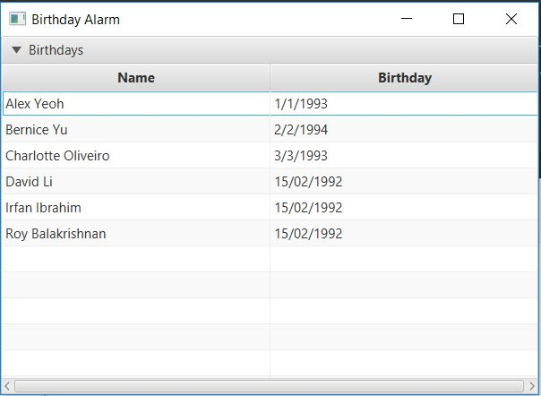

= Adeeb Ashraf - Project Portfolio
ifdef::env-github,env-browser[:outfilesuffix: .adoc]
:imagesDir: ../images
:stylesDir: ../stylesheets

== Project: DeathNote
DeathNote is a desktop address book application used for keeping track of the people you hate. The user interacts with it using a CLI, and it has a GUI created with JavaFX. It is written in Java, and has about 6 kLoC.

*Code contributed*:

https://github.com/CS2103AUG2017-W10-B3/main/blob/master/collated/main/chilipadiboy.md[Functional code]
https://github.com/CS2103AUG2017-W10-B3/main/blob/master/collated/test/chilipadiboy.md[Test code]

=== Enhancement Added:  Added Birthday and Remarks Parameters

Person Card shows birthday and remarks +

=== Enhancement Added: added Remark Command

Allows the adding of remarks using the `remark ` command. +

==== External behavior

---
#Start of Extract https://github.com/CS2103AUG2017-W10-B3/DeathNote/blob/master/docs/UserGuide.adoc[from: User Guide]#

include::../UserGuide.adoc[tag=bday]

include::../UserGuide.adoc[tag=remark]

#End of Extract#

==== Justification

---

This feature allows users to further personalize each contact with more parameters +

==== Implementation

---
https://github.com/CS2103AUG2017-W10-B3/main/pull/8[Refer to this pull request for implementation]

---

=== Enhancement Added: Birthday Reminder Window
Allows a quick and easy view of contacts's corresponding birthdays. +

==== External Behaviour
---
#Start of Extract https://github.com/CS2103AUG2017-W10-B3/DeathNote/blob/master/docs/UserGuide.adoc[from: User Guide]#

include::../UserGuide.adoc[tag=brem]

#End of Extract#

==== Justification

---
This features lets users to see upcoming birthdays for all the contacts at once glance.

=== Implementation

---
https://github.com/CS2103AUG2017-W10-B3/main/pull/101[Refer to this pull request for implementation]

---

=== Other Contributions
. Added various tests and documentation updates
. Added Alias to some commands for themeing purposes
