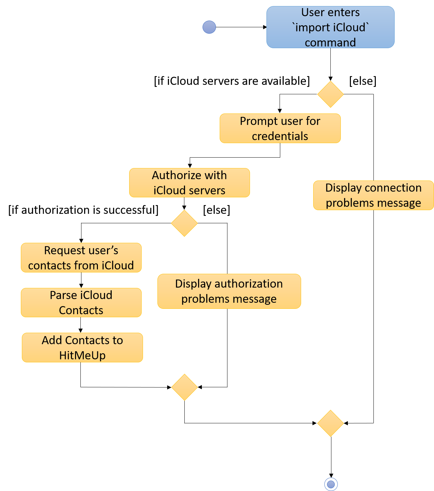

= Daniel Berzin Chua Yuan Siang - Project Portfolio
ifdef::env-github,env-browser[:outfilesuffix: .adoc]
:imagesDir: ../images
:stylesDir: ../stylesheets
:repoURL: https://github.com/CS2103AUG2017-W14-B3/main

== Project: HitMeUp
image::../images/Ui.png[width="800"]

include::../../README.adoc[tag=introduction]

include::../../README.adoc[tag=features]

*Code contributed*: [{repoURL}/tree/master/collated/main/danielbrzn.md[Functional code]] [{repoURL}/tree/master/collated/test/danielbrzn.md[Test code]]

=== Enhancement Added: Google Contacts Import

==== External behavior

---
#Start of Extract [from: User Guide]#

include::../UserGuide.adoc[tag=import]

#End of Extract#

==== Justification

---

Users of HitMeUp would want a quick and easy way to get started with the application, especially if they have a large amount of contacts. +
Having an import function that takes in all their contacts from Google in a matter of seconds allows them to not worry about the transition
to a new application.

==== Implementation

---
#Start of Extract [from: Developer Guide]#

include::../DeveloperGuide.adoc[tag=import]

#End of Extract#

---

=== Enhancement Added: Location Command

==== External behavior

---
#Start of Extract [from: User Guide]#

include::../UserGuide.adoc[tag=location]

#End of Extract#

==== Justification

---

While having the location of a contact is useful, it is inconvenient for the user to copy the address into Google Maps
manually in order to figure out the directions to a friend's place. As such, the location command allows the user to directly view the location of a contact
in HitMeUp without having to switch to a browser.

==== Implementation

---
#Start of Extract [from: Developer Guide]#

include::../DeveloperGuide.adoc[tag=location]

#End of Extract#

---

=== Enhancement Proposed: iCloud Contacts Import

==== External behavior

---
The iCloud import would be invoked by typing `iCloud` as the parameter for the import command instead of `Google`.

==== Justification

---
While import from Google Contacts is available, there may be users who have their contacts stored on iCloud instead and would prefer
to import from iCloud instead of having to manually add their contacts. Having this feature would allow the user the freedom of choice in
which cloud service to import their contacts from, and would thus allow HitMeUp to be a more versatile application.

==== Implementation

---

The iCloud import would be facilitated by the `CloudKit JS` framework provided by Apple in their Developer Program. However, as there are no native Java APIs
provided by Apple for usage, the import would have to be facilitated using HTTP requests in contrast to the implementation of the Google import. The http://unirest.io/java.html[Unirest] HTTP Request libraries would be used to achieve this.

A HTTP request would be sent to Apple's servers with the user's credentials for authentication. Once authenticated, another request containing parameters to access the contacts
of the authenticated user would be sent, and the returned data would be parsed into a `Person` and added to the application if the fields are valid.

The following activity diagram summarizes the flow of the iCloud import:

The user's credentials will never be stored in the application.

---

=== Other contributions
* Added alias command (Pull requests https://github.com/CS2103AUG2017-W14-B3/main/pull/19[#19], https://github.com/CS2103AUG2017-W14-B3/main/pull/21[#21])
* Made fields other than person name and phone number optional (Pull request https://github.com/CS2103AUG2017-W14-B3/main/pull/71[#71])
* Added fields for Instagram and Twitter accounts (Pull request https://github.com/CS2103AUG2017-W14-B3/main/pull/85[#85])
* Found 3 bugs for team `T15-B3` during acceptance testing. (Issues https://github.com/CS2103AUG2017-T15-B3/main/issues/111#event-1325939033[#111], https://github.com/CS2103AUG2017-T15-B3/main/issues/112#event-1333200180[#112], https://github.com/CS2103AUG2017-T15-B3/main/issues/116#event-1325924919[#116])
* Collated the user stories and some use cases (Pull request https://github.com/CS2103AUG2017-W14-B3/main/pull/1[#1])
* Responsible for managing weekly milestones and releases
* Set up AppVeyor and Travis CI for the team repository
