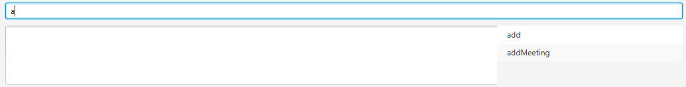

= OurAB - Manual Testing Script
:experimental:

=== `Setting Up`

** Download OurAB.jar and place it in a clean folder. Double click on the .jar file to start the OurAB application.
   Sample data will be generated automatically.

=== `UI features`

==== [.underline]#Splash Screen#

** Expected behaviour:
*** When the address book is loading, a splash screen should appear.

==== [.underline]#Command Box Helper#

** Type without pressing enter: kbd:[a]
** Expected Behaviour:
*** All commands starting with `a` are displayed in the command box helper.

** Press the kbd:[&darr;] key, followed by the kbd:[TAB] key.
** Expected Behaviour:
*** Display should show:

==== [.underline]#Settings Selector#

** Type without pressing enter: `pref` or `choose`
** Expected Behaviour:
*** Settings selector should pop up at the side:

** Press the kbd:[&larr;Backspace] key
** Command line should now contain: `pre` or `choos`
** Expected Behaviour:
*** Settings selector should slide out of screen.

==== [.underline]#Changing user preferences#

*Use `pref` command to view or change preferences*

** *View the current path of OurAB data*
*** Type and press enter: `pref abpath`
*** Expected output:
+
----
data/addressbook.xml
----

** *Change the theme of the OurAB*
*** Type and press enter: `pref theme dark`
*** Expected output:
+
----
Edited preference: Theme
from Light
to Dark
----
+
*** Expected behaviour: The colour theme of the address book changes into a "dark" theme.

*** Type and press enter: `pref theme light`
*** Expected output:
+
----
Edited preference: Theme
from Dark
to Light
----
+
*** Expected behaviour: The colour theme of the address book changes back into a "light" theme.

*** Type and press enter: `pref theme rainbow`
*** Expected output:
+
----
Invalid value rainbow for preference key Theme
----
+
*** Type and press enter: `pref CAP 5.0`
*** Expected output:
+
----
Invalid preference key: CAP
----

=== `Address list features`

==== [.underline]#Profile Picture#

*Add a new user with existing Gravatar*

** Type and press enter: `add n/Jon Smith p/12341234 e/e0005091@u.nus.edu a/10 Kent Ridge Crescent, 119260 t/friends`
** Expected behaviour: A new person is added and the profile picture of that person is the CS2103 logo. Note that the person is added to the bottom of the list.
+

*Add a new user without existing Gravatar*

** Type and press enter: `add n/Liu Hang p/12344321 e/liuhang@u.nus.edu a/25 Prince George's Park, 118420 t/friends`
** Expected behaviour: A new person is added and the profile picture of that person is the default silhouette photo. Note that the person is added to the bottom of the list.
+

...
+
put your stuff below here
